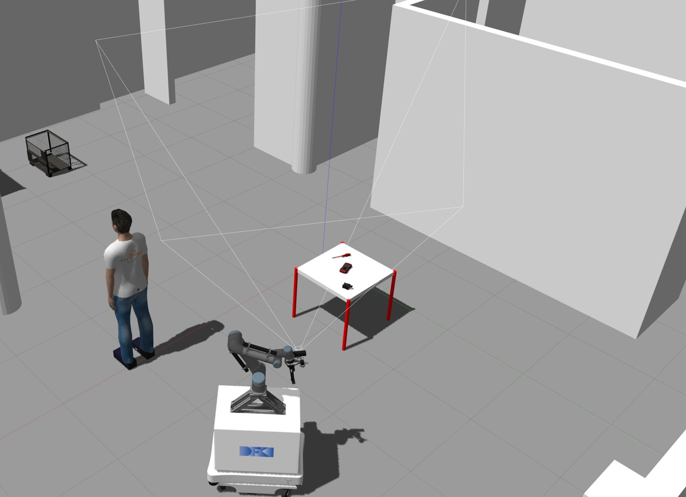

# gazebo_logical_camera_plugin_ros

This gazebo plugin can be used to simulate object detection in simulation. When the plugin is attached to a logical camera sensor, objects that appear within the camera's frustum will have their pose and bounding box information published as ObjectList ROS messages.

 

 

## Installation

These installation instructions assume that Gazebo and ROS have already been installed. In addition, you should already have a catkin workspace (YOUR_CATKIN_WS) built and containing a gazebo simulation package (world, urdfs, launch files, etc).

 

1. Clone this repo

        cd YOUR_CATKIN_WS/src
        git clone git@git.ni.dfki.de:environment_representation/gazebo_logical_camera_plugin_ros.git

2. Import dependency repos

        vcs import < gazebo_logical_camera_plugin_ros/my.repos

3. Build workspace

        cd YOUR_CATKIN_WS
        source YOUR_CATKIN_WS/devel/setup.bash
        catkin build

 

## Messages

The pose_selector uses the ObjectPose and ObjectList messages from [object_pose_msgs](https://git.ni.dfki.de/environment_representation/object_pose_msgs) package.

 

## Example Usage

The following snippet can be used as an usage example:

    <joint name="test_rgb_logical_joint" type="fixed">
      <origin xyz="0 0 0" rpy="0 0 0" />
      <parent link="camera_rgb_frame" />
      <child link="test_logical_camera_frame" />
    </joint>
    <link name="test_logical_camera_frame"/>

    <gazebo reference="test_logical_camera_frame">
      <sensor name="logical_camera" type="logical_camera"> 
        <logical_camera>
          <near>0.05</near>  <!-- near clippling plane, in meters -->
          <far>3.50</far>    <!-- far clipping plane, in meters -->
          <horizontal_fov>${60.0 * pi/180.0}</horizontal_fov> <!-- horizontal FOV, in radians -->
          <aspect_ratio>${640.0/480.0}</aspect_ratio> <!-- camera aspect ratio -->
        </logical_camera>
        <visualize>false</visualize> <!-- visualize camera frustum in Gazebo (can cause issues) -->
        <always_on>true</always_on> 
        <update_rate>10</update_rate> <!-- update rate of logical camera -->
        <plugin name="logical_camera_plugin" filename="liblogical_camera_plugin.so">
          <cameraName>test_logical_camera</cameraName>
          <imageTopicName>test_logical_image</imageTopicName>
          <frameName>test_logical_camera_frame</frameName>
        </plugin>
      </sensor>
    </gazebo>

 

In general, the plugin should be attached to a similar link as the actual camera (camera_rgb_frame in above example, where the test_logical_camera_frame is attached at the same lcoation as camera_rgb_frame). The FOV, clipping planes, aspect ratio, and ROS publishing parameters can be configured in the urdf.xacro.

 